  

  
  
  
  

  

  <em>I work at the intersection of <strong>business strategy</strong> and <strong>engineering</strong>.</em> 
  <em>The goal is always to turn the latest IT (LLMs, OSINT automation, cloud-native data pipelines)</em> 
  <em>into measurable revenue, cost-saving, and risk-reduction for the organisations I work with.</em>

  <em>End-to-end ownership from database schema to backend services to the occasional frontend.</em> 
  <em>Specialty: <strong>automation</strong>.</em>

---

### 🛰️ [Intellens](https://intellens.ai)

> *A customisable anti-virus for your entire supply chain. Scans
> 200,000+ daily sources in 40+ languages, monitors 500+ international
> databases, and tracks 3,000+ ports and airports.*

AI-powered supply-chain risk intelligence that detects threats weeks in
advance across 195+ countries, replacing reactive monitoring with
proactive insights. → **[intellens.ai](https://intellens.ai)**

---

### 🧰 Daily drivers

  
  
  
  
  

#### Also comfortable with

  
  
  
  
  
  
  
  
  
  

---

### 🎓 Background

**Copenhagen Business School**:

- **MSc Cand.merc.(it.)** in IT Management & Business Economics *(2022-24)*.
  Master's thesis: built an OSINT engine that geolocates offices and
  factories for ~250M companies worldwide to automate supplier risk
  analysis.
- **BSc Business Administration & Digital Management** *(2019-22)*.
  Bachelor's dissertation: success factors behind the zero-commission
  trading platforms in the US and the data-ethical implications of
  their business model.

Before CBS: 3 years as **Sergeant in the Danish Army** (commanded
platoons up to 45 people).

---

### 📊 GitHub activity

  

#### Contribution snake 🐍

  

#### Activity graph

  

